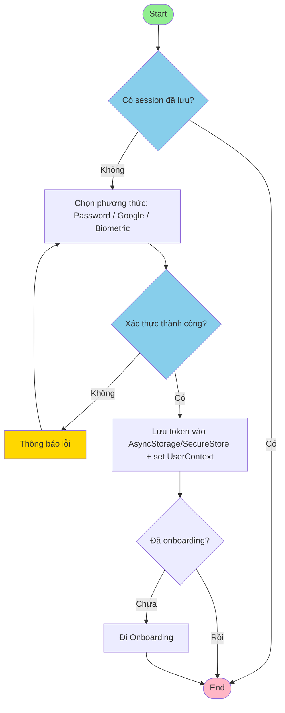

# Các Activity Chính (Bản rút gọn, bám code hiện tại)

---

## 4.3.2.1. Activity: Xác thực người dùng


**Các bước chính:**
1. Mở app, kiểm tra session/token đã lưu.
2. Nếu có session hợp lệ → vào Home.
3. Nếu chưa, người dùng chọn phương thức (Password/Google/Biometric).
4. Thực hiện xác thực; nếu lỗi hiển thị thông báo và yêu cầu thử lại.
5. Thành công → lưu token vào AsyncStorage/SecureStore và cập nhật UserContext.
6. Kiểm tra Onboarding; nếu chưa xong thì chuyển qua Onboarding, nếu rồi thì vào Home.

**Khớp code:**
- Màn hình: [app/auth/login.tsx](app/auth/login.tsx) (Google Sign-in, password, toggle login/register, lưu vào AsyncStorage)
- Repo: [repos/authRepo.ts](repos/authRepo.ts) (hash mật khẩu, tạo người dùng, login)
- Context: [context/userContext.tsx](context/userContext.tsx) (loginSet, lưu user)
- Onboarding: [app/onboarding/*](app/onboarding) (chạy khi chưa hoàn tất thiết lập)

---

## 4.3.2.2. Activity: Thêm giao dịch

```mermaid
flowchart TD
    A([Start]) --> B[Hiển thị form giao dịch]
    B --> C{Nhập dữ liệu
    (thủ công hoặc giọng nói)}
    C --> D{Hợp lệ?}
    D -->|Không| E[Hiển thị lỗi]
    E --> C
    D -->|Có| F[Lưu vào SQLite (addExpense/addIncome)]
    F --> G[Cập nhật số dư ví]
    G --> H[Đánh dấu cần sync (scheduleSyncDebounced)]
    H --> I([End - quay lại danh sách])

    style A fill:#90EE90
    style I fill:#FFB6C6
    style D fill:#87CEEB
    style E fill:#FFD700
```
**Các bước chính:**
1. Mở form thêm giao dịch.
2. Nhập dữ liệu thủ công hoặc từ giọng nói (AI parser).
3. Kiểm tra hợp lệ; nếu lỗi, báo và cho nhập lại.
4. Lưu vào SQLite (addExpense/addIncome/updateTx).
5. Cập nhật số dư ví.
6. Đánh dấu cần đồng bộ (scheduleSyncDebounced).
7. Đóng form/quay lại danh sách.

**Khớp code:**
- Form: [app/add-transaction.tsx](app/add-transaction.tsx) (chọn loại, danh mục, ví, ngày; có hỗ trợ ghi âm/AI)
- Repo: [repos/transactionRepo.ts](repos/transactionRepo.ts) (addExpense/addIncome/updateTx, thường gọi scheduleSyncDebounced)
- Voice/AI: [services/tensorflowTransactionParser.ts](services/tensorflowTransactionParser.ts) (parse câu lệnh giọng nói)

---

## 4.3.2.3. Activity: Lập kế hoạch ngân sách

```mermaid
flowchart TD
    A([Start]) --> B[Nhập thu nhập + chu kỳ tại setup]
    B --> C[Nhận gợi ý AI 50/30/20 (generateSmartBudget)]
    C --> D{Người dùng duyệt / chỉnh sửa phân bổ}
    D --> E[Lưu budget + allocations vào SQLite]
    E --> F[Trigger sync (scheduleSyncDebounced)]
    F --> G([End - quay lại danh sách ngân sách])

    style A fill:#90EE90
    style G fill:#FFB6C6
    style D fill:#87CEEB
```
**Các bước chính:**
1. Nhập thu nhập, chu kỳ, mô tả tại màn hình setup.
2. Nhận gợi ý AI 50/30/20 (generateSmartBudget).
3. Người dùng duyệt/chỉnh sửa phân bổ.
4. Lưu budget + allocations vào SQLite (createBudget).
5. Trigger sync (scheduleSyncDebounced) và quay lại danh sách ngân sách.

**Khớp code:**
- Nhập đầu vào: [app/budget/setup.tsx](app/budget/setup.tsx)
- Gợi ý + chỉnh sửa + lưu: [app/budget/suggest.tsx](app/budget/suggest.tsx) (gọi generateSmartBudget, createBudget)
- Repo: [repos/budgetRepo.ts](repos/budgetRepo.ts) (createBudget, lưu allocations, trigger sync + alert)
- AI logic: [services/budgetAI.ts](services/budgetAI.ts) và [services/budgetAIService.ts](services/budgetAIService.ts)

---

## 4.3.2.4. Activity: Đồng bộ dữ liệu (ngầm)

```mermaid
flowchart TD
    A([Trigger: thay đổi dữ liệu / timer / app resume]) --> B[Debounce + rate-limit (syncTrigger)]
    B --> C{Online? và Firebase signed-in?}
    C -->|Không| I[Backoff + chờ lần sau]
    C -->|Có| D[Pull incremental theo updated_at]
    D --> E{Merge xung đột (last-write-wins)}
    E --> F[Push các bản ghi local bẩn]
    F --> G{Thành công?}
    G -->|Không| H[Cập nhật syncState(error) + retry queue]
    G -->|Có| J[Cập nhật lastSyncedAt + syncState(idle)]
    H --> I([End])
    J --> I([End])

    style A fill:#90EE90
    style I fill:#FFB6C6
    style C fill:#87CEEB
    style E fill:#87CEEB
    style G fill:#87CEEB
    style H fill:#FFD700
```
**Các bước chính:**
1. Sự kiện thay đổi dữ liệu/timer/app resume kích hoạt syncTrigger (debounce + rate-limit).
2. Kiểm tra online và Firebase signed-in; nếu offline thì backoff chờ.
3. Pull incremental từ Firestore theo updated_at.
4. Merge xung đột (last-write-wins) và lưu local.
5. Push các bản ghi local bẩn lên Firestore.
6. Nếu push lỗi, cập nhật syncState(error) và đưa vào retry queue; nếu thành công, cập nhật lastSyncedAt + syncState(idle).
7. Kết thúc chu kỳ, chờ lần trigger tiếp theo.

**Khớp code:**
- Trigger/Backoff: [services/syncTrigger.ts](services/syncTrigger.ts) (debounce, NetInfo, Firebase sign-in check)
- Orchestrator: [services/syncService.ts](services/syncService.ts) (coalesce, set syncState)
- Sync logic: [services/firestoreSync.ts](services/firestoreSync.ts) (incremental by updated_at, last-write-wins, push/pull)
- Trạng thái: [services/syncState.ts](services/syncState.ts) (status, lastSyncedAt)
- DB local: [db/index.ts](db/index.ts)

---

## Tóm tắt nhanh

| Activity | Mục đích | Điểm chốt quan trọng |
|----------|---------|----------------------|
| Xác thực người dùng | Vào app với phiên hợp lệ | Password/Google/Biometric, lưu token, qua Onboarding nếu cần |
| Thêm giao dịch | Ghi nhận thu/chi | Form thủ công hoặc giọng nói, lưu SQLite, cập nhật số dư, trigger sync |
| Lập kế hoạch ngân sách | Thiết lập và lưu phân bổ | Nhập income/period, AI gợi ý 50/30/20, chỉnh sửa, lưu allocations, trigger sync |
| Đồng bộ dữ liệu | Giữ nhất quán local-cloud | Debounce + online/Firebase check, pull/push incremental, last-write-wins, cập nhật syncState |
