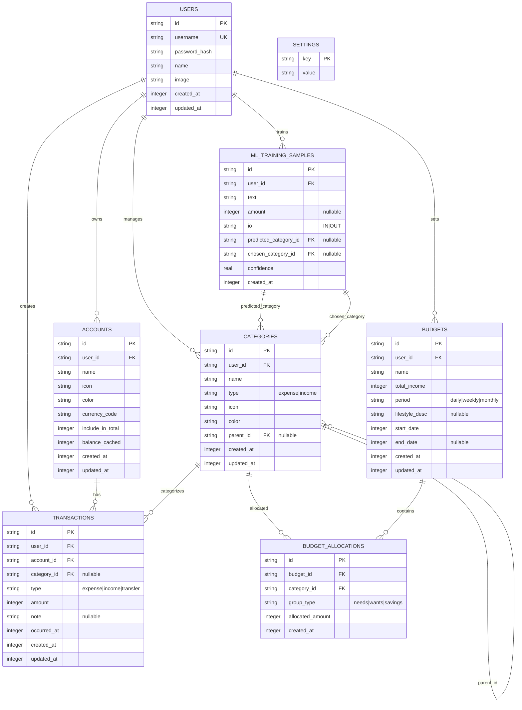

# Entity Relationship Diagram (ERD)

## Mermaid ERD - Dành cho DrawIO

Sao chép mã dưới đây vào DrawIO hoặc công cụ Mermaid khác:



---

## Bảng Chi Tiết

### 1. **USERS** (Người Dùng)
| Cột | Kiểu | Ghi Chú |
|-----|------|--------|
| id | TEXT | Primary Key |
| username | TEXT | Unique, bắt buộc |
| password_hash | TEXT | Hash mật khẩu |
| name | TEXT | Tên người dùng |
| image | TEXT | URL ảnh đại diện |
| created_at | INTEGER | Unix timestamp |
| updated_at | INTEGER | Unix timestamp |

**Mô tả**: Lưu trữ thông tin tài khoản người dùng của ứng dụng.

---

### 2. **ACCOUNTS** (Tài Khoản Tài Chính)
| Cột | Kiểu | Ghi Chú |
|-----|------|--------|
| id | TEXT | Primary Key |
| user_id | TEXT | Foreign Key → USERS |
| name | TEXT | Tên tài khoản (VD: "Tiền mặt", "Thẻ tín dụng") |
| icon | TEXT | Icon đại diện |
| color | TEXT | Màu sắc |
| currency_code | TEXT | Mã tiền tệ (VND, USD, ...) |
| include_in_total | INTEGER | Boolean: có tính vào tổng tài sản |
| balance_cached | INTEGER | Số dư hiện tại (được cập nhật qua trigger) |
| created_at | INTEGER | Unix timestamp |
| updated_at | INTEGER | Unix timestamp |

**Mối quan hệ**: 
- Mỗi tài khoản thuộc về 1 người dùng
- Một tài khoản có nhiều giao dịch

---

### 3. **CATEGORIES** (Danh Mục)
| Cột | Kiểu | Ghi Chú |
|-----|------|--------|
| id | TEXT | Primary Key |
| user_id | TEXT | Foreign Key → USERS |
| name | TEXT | Tên danh mục (VD: "Ăn uống", "Xăng xế") |
| type | TEXT | 'expense' hoặc 'income' |
| icon | TEXT | Icon đại diện |
| color | TEXT | Màu sắc |
| parent_id | TEXT | Foreign Key → CATEGORIES (nullable - cho phép phân cấp) |
| created_at | INTEGER | Unix timestamp |
| updated_at | INTEGER | Unix timestamp |

**Mối quan hệ**:
- Mỗi danh mục thuộc về 1 người dùng
- Danh mục có thể có danh mục cha (phân cấp)
- Danh mục được sử dụng trong giao dịch

---

### 4. **TRANSACTIONS** (Giao Dịch)
| Cột | Kiểu | Ghi Chú |
|-----|------|--------|
| id | TEXT | Primary Key |
| user_id | TEXT | Foreign Key → USERS |
| account_id | TEXT | Foreign Key → ACCOUNTS (bắt buộc) |
| category_id | TEXT | Foreign Key → CATEGORIES (nullable) |
| type | TEXT | 'expense', 'income' hoặc 'transfer' |
| amount | INTEGER | Số tiền (đơn vị: đồng) |
| note | TEXT | Ghi chú giao dịch |
| occurred_at | INTEGER | Unix timestamp của giao dịch |
| created_at | INTEGER | Unix timestamp tạo |
| updated_at | INTEGER | Unix timestamp cập nhật |

**Mối quan hệ**:
- Mỗi giao dịch thuộc về 1 người dùng, 1 tài khoản
- Giao dịch có thể liên kết với 1 danh mục
- Có trigger tự động cập nhật balance_cached trong ACCOUNTS

**Index**: idx_tx_user_time (user_id, occurred_at), idx_tx_account, idx_tx_category

---

### 5. **BUDGETS** (Ngân Sách)
| Cột | Kiểu | Ghi Chú |
|-----|------|--------|
| id | TEXT | Primary Key |
| user_id | TEXT | Foreign Key → USERS |
| name | TEXT | Tên kế hoạch ngân sách |
| total_income | INTEGER | Tổng thu nhập dự kiến |
| period | TEXT | 'daily', 'weekly' hoặc 'monthly' |
| lifestyle_desc | TEXT | Mô tả lối sống (nullable) |
| start_date | INTEGER | Unix timestamp ngày bắt đầu |
| end_date | INTEGER | Unix timestamp ngày kết thúc (nullable) |
| created_at | INTEGER | Unix timestamp |
| updated_at | INTEGER | Unix timestamp |

**Mối quan hệ**:
- Mỗi ngân sách thuộc về 1 người dùng
- Một ngân sách có nhiều cấp phát

---

### 6. **BUDGET_ALLOCATIONS** (Cấp Phát Ngân Sách)
| Cột | Kiểu | Ghi Chú |
|-----|------|--------|
| id | TEXT | Primary Key |
| budget_id | TEXT | Foreign Key → BUDGETS |
| category_id | TEXT | Foreign Key → CATEGORIES |
| group_type | TEXT | 'needs', 'wants' hoặc 'savings' |
| allocated_amount | INTEGER | Số tiền cấp phát |
| created_at | INTEGER | Unix timestamp |

**Mối quan hệ**:
- Mỗi cấp phát liên kết 1 ngân sách với 1 danh mục
- Định nghĩa lượng tiền cho mỗi danh mục trong ngân sách

---

### 7. **ML_TRAINING_SAMPLES** (Dữ Liệu Huấn Luyện ML)
| Cột | Kiểu | Ghi Chú |
|-----|------|--------|
| id | TEXT | Primary Key |
| user_id | TEXT | Foreign Key → USERS |
| text | TEXT | Văn bản mô tả giao dịch |
| amount | INTEGER | Số tiền (nullable) |
| io | TEXT | 'IN' (income) hoặc 'OUT' (expense) |
| predicted_category_id | TEXT | FK → CATEGORIES (danh mục dự đoán) |
| chosen_category_id | TEXT | FK → CATEGORIES (danh mục được chọn thực tế) |
| confidence | REAL | Độ tin cậy của dự đoán |
| created_at | INTEGER | Unix timestamp |

**Mối quan hệ**:
- Lưu mẫu dữ liệu để cải thiện mô hình ML
- Liên kết với danh mục dự đoán và danh mục thực tế

---

### 8. **SETTINGS** (Cài Đặt)
| Cột | Kiểu | Ghi Chú |
|-----|------|--------|
| key | TEXT | Primary Key |
| value | TEXT | Giá trị cài đặt |

**Mô tả**: Lưu các cài đặt toàn cục (VD: schema_version)

---

## Mối Quan Hệ Chính

```
USERS (1) ──────── (N) ACCOUNTS
USERS (1) ──────── (N) CATEGORIES
USERS (1) ──────── (N) TRANSACTIONS
USERS (1) ──────── (N) BUDGETS
USERS (1) ──────── (N) ML_TRAINING_SAMPLES

ACCOUNTS (1) ────── (N) TRANSACTIONS
CATEGORIES (1) ──── (N) TRANSACTIONS
CATEGORIES (1) ──── (N) BUDGET_ALLOCATIONS
CATEGORIES (1) ──── (0..1) CATEGORIES (parent_id)

BUDGETS (1) ──────── (N) BUDGET_ALLOCATIONS
```

---

## Ghi Chú Quan Trọng

1. **Foreign Keys**: Tất cả được bật (PRAGMA foreign_keys = ON)
2. **ON DELETE CASCADE**: Xóa người dùng sẽ xóa tất cả dữ liệu liên kết
3. **Trigger Tự Động**: balance_cached được cập nhật tự động khi giao dịch thay đổi
4. **Index**: Được tạo để tối ưu truy vấn thường xuyên
5. **Thời gian**: Tất cả sử dụng Unix timestamp (giây)
6. **Danh mục phân cấp**: Categories có thể có parent_id để tạo cấu trúc phân cấp

---

## Cách Sử Dụng với DrawIO

1. Truy cập [DrawIO](https://www.draw.io/)
2. Tạo diagram mới
3. Chọn **File → Import from → Mermaid**
4. Dán toàn bộ mã Mermaid từ section "Mermaid ERD" ở trên
5. Diagram sẽ được tạo tự động
